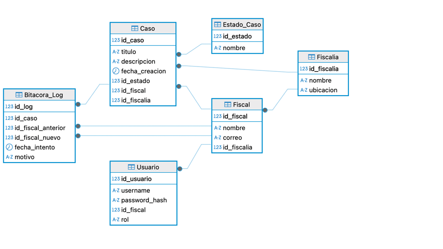
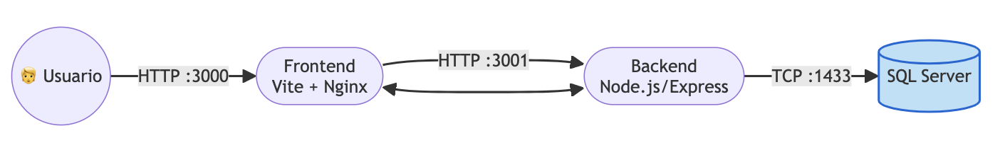
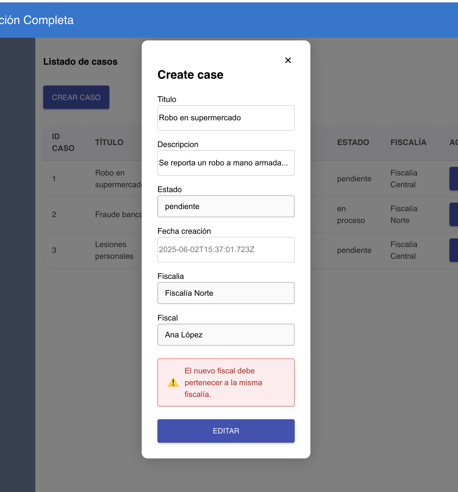
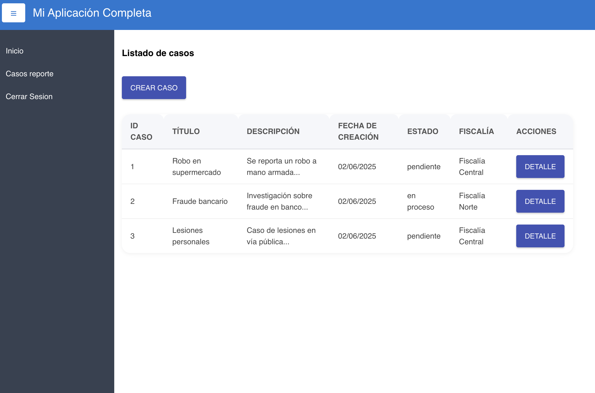

# simple-crud

## para correr el programa 

``` Docker compose build```

``` Docker compose up```

``` Correr el script de init-db.sql  -- > para tener data```

```
 cambiar el host: 
 127.0.0.1        midominio.local
```
### entidad relacion


### docker


### app






``` 
backend: express
frontend: reactjs (vite)
```


